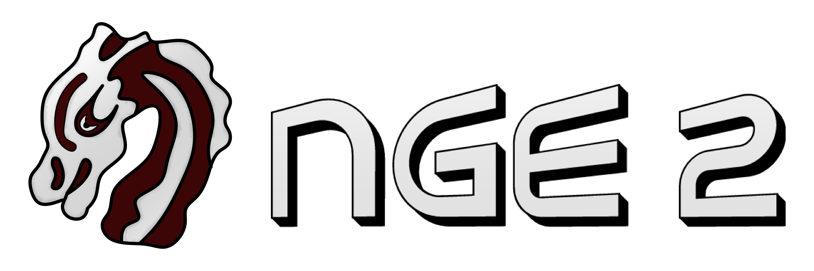

# Norbert's Game Engine

A collection of libraries for easy software and game development.

## Features
* Window management
* Keyboard, Mouse and Gamepad input
* Shader management
* Layer system
* Content and Package system
* Doer/Module system
* Game World system
* Simple collision detection
* Audio playback (SoLoud)
* Native dear ImGui support
* Custom file format
* 3D Mesh/Material system
* Custom String type
* Output Console
* Multi window rendering
* ...

Everything is split into their own respective libraries, allowing you to simply use the features you need. They all seamlessly tie in with one another.

## Building
Supported rendering backends:
* Direct3D 11
* Direct3D 12
* Vulkan

Supported platform:
* Windows-x64 (7+)

Supported environment:
* VS2022 and above

Uses C17 and C++17

Run 'BUILD.BAT' and then open the project solution and hit 'build solution'.
Try running one of the examples to see if everything is working correctly.

## Learning
Have a look at the examples as well as the documentation for refrence.

## Getting Involved
Everyone is welcome to contribute to NGE2 by submitting bug reports, porting and testing on different platforms and writing examples.